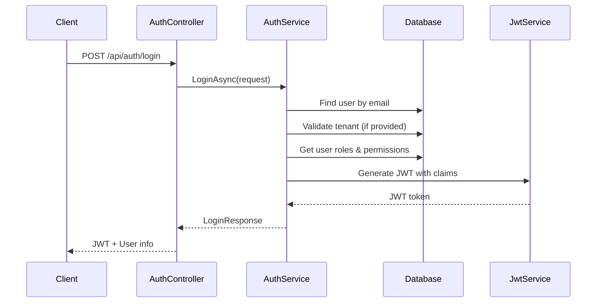
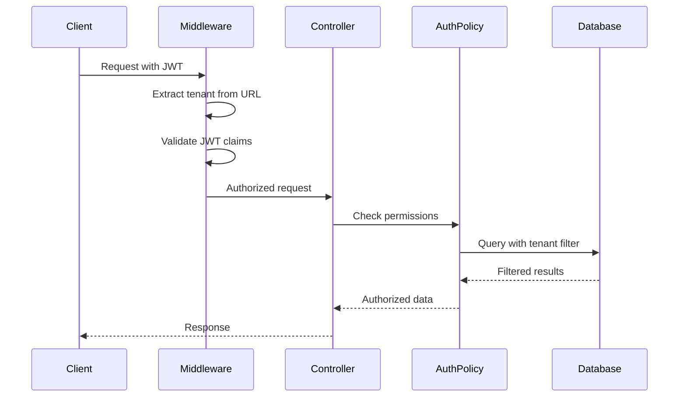

# 🏗️ Multi-Tenant RBAC Architecture Guide

## Overview

The Nomad Surveys API implements a comprehensive **Multi-Tenant Role-Based Access Control (RBAC)** system with **Claims-Based Authorization**. This document explains how the entire Role, User, and Tenant flow works.

## 🏢 Multi-Tenancy Architecture

### Shared Schema Approach
- **Single Database**: All tenants share the same database schema
- **Tenant Isolation**: Data is isolated using `TenantId` columns and global query filters
- **Tenant Resolution**: Tenants are identified by URL path prefix (e.g., `/acme-corp/api/users`)

### Tenant Entity Structure
```csharp
public class Tenant
{
    public Guid Id { get; set; }
    public string Name { get; set; }        // "Acme Corporation"
    public string Slug { get; set; }        // "acme-corp" (URL-friendly)
    public string Description { get; set; }
    public bool IsActive { get; set; }
    public DateTime CreatedAt { get; set; }
    public DateTime? UpdatedAt { get; set; }
    
    // Navigation properties
    public Company? Company { get; set; }
    public ICollection<ApplicationUser> Users { get; set; }
    public ICollection<TenantRole> Roles { get; set; }
}
```

## 👥 User Management System

### User Entity (ApplicationUser)
Extends ASP.NET Core Identity's `IdentityUser` with tenant-aware properties:

```csharp
public class ApplicationUser : IdentityUser<Guid>
{
    public string FirstName { get; set; }
    public string LastName { get; set; }
    public Guid? TenantId { get; set; }     // NULL for SuperAdmin
    public bool IsActive { get; set; }
    public DateTime CreatedAt { get; set; }
    public DateTime? UpdatedAt { get; set; }
    public DateTime? LastLoginAt { get; set; }
    
    // Navigation properties
    public Tenant? Tenant { get; set; }
    public ICollection<UserTenantRole> UserTenantRoles { get; set; }
}
```

### User Types
1. **SuperAdmin**: `TenantId = NULL`, global access
2. **Tenant Users**: `TenantId = specific tenant`, scoped access

## 🔐 Role-Based Access Control (RBAC)

### Role Hierarchy
```
SuperAdmin (Global)
├── TenantAdmin (Tenant-scoped)
└── Participant (Tenant-scoped)
```

### Role Entity Structure
```csharp
public class TenantRole : IdentityRole<Guid>
{
    public Guid? TenantId { get; set; }     // NULL for global roles
    public string Description { get; set; }
    public bool IsActive { get; set; }
    public DateTime CreatedAt { get; set; }
    public DateTime? UpdatedAt { get; set; }
    
    // Navigation properties
    public Tenant? Tenant { get; set; }
    public ICollection<RolePermission> RolePermissions { get; set; }
    public ICollection<UserTenantRole> UserTenantRoles { get; set; }
}
```

### User-Role Assignment
Many-to-many relationship through `UserTenantRole`:

```csharp
public class UserTenantRole
{
    public Guid Id { get; set; }
    public Guid UserId { get; set; }
    public Guid RoleId { get; set; }
    public Guid? TenantId { get; set; }     // Scope of the role assignment
    public DateTime AssignedAt { get; set; }
    public DateTime? ExpiresAt { get; set; }
    public bool IsActive { get; set; }
    
    // Navigation properties
    public ApplicationUser User { get; set; }
    public TenantRole Role { get; set; }
    public Tenant? Tenant { get; set; }
}
```

## 🎯 Permission System

### Fine-Grained Permissions
```csharp
public class Permission
{
    public Guid Id { get; set; }
    public string Name { get; set; }        // "manage_users"
    public string DisplayName { get; set; } // "Manage Users"
    public string Description { get; set; }
    public string Category { get; set; }    // "User Management"
    public bool IsActive { get; set; }
    public DateTime CreatedAt { get; set; }
}
```

### Role-Permission Mapping
```csharp
public class RolePermission
{
    public Guid Id { get; set; }
    public Guid RoleId { get; set; }
    public Guid PermissionId { get; set; }
    public DateTime GrantedAt { get; set; }
    public bool IsActive { get; set; }
    
    // Navigation properties
    public TenantRole Role { get; set; }
    public Permission Permission { get; set; }
}
```

### Default Permissions by Role

#### SuperAdmin
- `manage_users` - Create/edit/delete users across all tenants
- `manage_surveys` - Full survey management across all tenants
- `view_reports` - Access all reports and analytics
- `fill_surveys` - Can fill any survey
- `assign_surveys` - Assign surveys to users
- `manage_company` - Manage company information

#### TenantAdmin
- `manage_users` - Create/edit/delete users within tenant
- `manage_surveys` - Full survey management within tenant
- `view_reports` - Access tenant reports and analytics
- `fill_surveys` - Can fill tenant surveys
- `assign_surveys` - Assign surveys within tenant
- `manage_company` - Manage tenant company information

#### Participant
- `fill_surveys` - Can fill assigned surveys only

## 🔄 Authentication & Authorization Flow

### 1. Login Process


### 2. JWT Token Structure
```json
{
  "sub": "user-id-guid",
  "email": "admin@acmecorp.com",
  "FirstName": "John",
  "LastName": "Doe",
  "TenantId": "tenant-id-guid",
  "role": ["TenantAdmin"],
  "Permission": ["manage_users", "manage_surveys", "view_reports"],
  "exp": 1694123456,
  "iss": "NomadSurveys",
  "aud": "NomadSurveysUsers"
}
```

### 3. Request Authorization


## 🛡️ Data Isolation Mechanisms

### 1. Global Query Filters
Automatically applied to all database queries:

```csharp
// In DbContext.OnModelCreating
modelBuilder.Entity<ApplicationUser>()
    .HasQueryFilter(u => _tenantId == null || u.TenantId == _tenantId);

modelBuilder.Entity<TenantRole>()
    .HasQueryFilter(r => _tenantId == null || r.TenantId == _tenantId);
```

### 2. Tenant Context Injection
```csharp
public class TenantContext
{
    public Guid? TenantId { get; set; }
    public string? TenantSlug { get; set; }
    public bool IsSuperAdmin { get; set; }
}
```

### 3. Automatic TenantId Assignment
```csharp
public override async Task<int> SaveChangesAsync(CancellationToken cancellationToken = default)
{
    foreach (var entry in ChangeTracker.Entries())
    {
        if (entry.Entity is ITenantEntity tenantEntity && entry.State == EntityState.Added)
        {
            if (_tenantContext.TenantId.HasValue && tenantEntity.TenantId == Guid.Empty)
            {
                tenantEntity.TenantId = _tenantContext.TenantId.Value;
            }
        }
    }
    
    return await base.SaveChangesAsync(cancellationToken);
}
```

## 🚀 API Endpoint Patterns

### Global Endpoints (No Tenant Context)
- `POST /api/auth/login` - Tenant user login
- `POST /api/auth/superadmin/login` - SuperAdmin login
- `GET /api/auth/me` - Current user info
- `GET /api/tenant` - List tenants (SuperAdmin only)
- `POST /api/tenant` - Create tenant (SuperAdmin only)

### Tenant-Scoped Endpoints
- `GET /{tenantSlug}/api/users` - List tenant users
- `POST /{tenantSlug}/api/users` - Create tenant user
- `GET /{tenantSlug}/api/company` - Get company info
- `PUT /{tenantSlug}/api/company` - Update company info

## 🔧 Middleware Pipeline

### 1. Tenant Resolution Middleware
```csharp
public class TenantResolutionMiddleware
{
    public async Task InvokeAsync(HttpContext context, RequestDelegate next)
    {
        var path = context.Request.Path.Value;
        var tenantSlug = ExtractTenantSlugFromPath(path);
        
        if (!string.IsNullOrEmpty(tenantSlug))
        {
            var tenant = await _tenantService.GetBySlugAsync(tenantSlug);
            _tenantContext.TenantId = tenant?.Id;
            _tenantContext.TenantSlug = tenantSlug;
        }
        
        await next(context);
    }
}
```

### 2. Authorization Policies
```csharp
services.AddAuthorization(options =>
{
    options.AddPolicy("SuperAdminOnly", policy =>
        policy.RequireRole("SuperAdmin"));
        
    options.AddPolicy("TenantAdminOrAbove", policy =>
        policy.RequireRole("SuperAdmin", "TenantAdmin"));
        
    options.AddPolicy("ManageUsers", policy =>
        policy.RequireClaim("Permission", "manage_users"));
});
```

## 📊 Database Schema Summary

### Core Tables
- `Users` - User accounts (extends Identity)
- `Roles` - Role definitions (extends Identity)
- `Tenants` - Tenant/organization information
- `Companies` - Company details per tenant
- `Permissions` - Available permissions
- `UserTenantRoles` - User-role assignments with tenant scope
- `RolePermissions` - Role-permission mappings

### Key Relationships
- User → Tenant (Many-to-One)
- User → Roles (Many-to-Many via UserTenantRole)
- Role → Permissions (Many-to-Many via RolePermission)
- Tenant → Company (One-to-One)
- Tenant → Users (One-to-Many)
- Tenant → Roles (One-to-Many)

This architecture provides secure, scalable multi-tenant RBAC with fine-grained permissions and complete data isolation between tenants.
